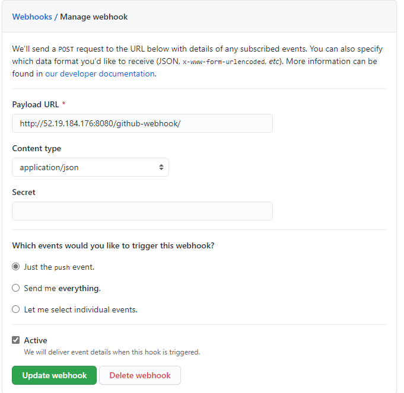

# Instructions of how to setup a CICD
- Once your Jenkins has been configured on your Jenkins Master EC2 instance, you can begin on the CI CD pipeline.

# CI 
- For the CI, our aim is for our Jenkins to detect a push to the `dev` branch in the repository, test that the code is running (tests carried out inside the EC2 instance) as desired, and push to `main` branch upon success. 
- Ensure you have connected your Jenkins to your GitHub repository with a Webhook:



**New Item -> Freestyle Project**
- [x] Discard old builds
  - Days to keep builds : 1 
  - Max# of build : 3 

- [x] -> GitHub project
  - Provide your GitHub Repo URL

- [x] Source Code Management -> Git
  - Provide your SSH Repo link
  - Provide the SSH private Key which should be connected to your Github repo in `Credentials` 
  - Branches to build -> `*/dev`

- [x] Build Triggers -> GitHub hook trigger for GITScm polling

- [x] Build
  - Execute Shell:

```shell
npm install 
npm test
``` 

- [x] Post-build Actions -> Git Publisher
  - [x] Push Only if Build Succeeds
  - Branches
    - Branch to push: `main`
    - Target Remote name: `origin` 

# CD - 1
- CD - 1 listens to the CI job, if the job succeeds (meaning code is functional on dev branch), the job will pull code from main branch and build the code images in docker containers and push the images to a DockerHub repo. This will be done by code written in a `Jenkinsfile`

```go
node {
    def app

    stage('Clone repository') {
        /* Let's make sure we have the repository cloned to our workspace */

        checkout scm
    }

    stage('Build image') {
        /* This builds the actual image; synonymous to
         * docker build on the command line */

        app = docker.build("matt791/docker-app-automated")
    }

    stage('Push image') {
        /* Finally, we'll push the image with two tags:
         * First, the incremental build number from Jenkins
         * Second, the 'latest' tag.
         * Pushing multiple tags is cheap, as all the layers are reused. */
        docker.withRegistry('https://registry.hub.docker.com', 'dockerhub_id') {
            app.push("${env.BUILD_NUMBER}")
            app.push("latest")
        }
    }
    
    stage('Remove local images') {
        sh"docker system prune -af"
   }
}
```
- Ensure you have created a DockerHub repo for this project

**New Item - Pipeline**
- [x] Discard old builds
  - Days to keep builds : 1 
  - Max# of build : 3 

- [x] -> GitHub project
  - Provide your GitHub Repo URL

- [x] Build after other projects are built
  - Projects to watch -> CI
    - [x] Trigger only if build is stable

- [x] Build Triggers -> GitHub hook trigger for GITScm polling

- Pipeline
  - Pipeline script from SCM, Git
  - Repositories
    - Provide your SSH repo link and credentials
    - Branches to build -> `*/main`
  - Script Path -> `Jenkinsfile`

# CD - 2
- This CD will listen to CD - 1, once the build has succeeded, this job will trigger. It will SSH into the `Live` EC2 instance, pull the newly created Docker Image and run `docker-compose up` which use the images and setup the app and db, visible on the `Public IP` of the instance at port 3000.

**New Item -> Freestyle Project**
- [x] Discard old builds
  - Days to keep builds : 1 
  - Max# of build : 3 

- [x] Build after other projects are built
  - Projects to watch -> CD-1
    - [x] Trigger only if build is stable

- [x] Use secret text(s) or file(s)
  - SSH User Private Key -> Provide AWS Key in a variable of your choice
    - e.g. `AWS_ACCESS_KEY`

- [x] Build
  - Execute Shell:

```bash
ssh -o "StrictHostKeyChecking=no" -i $AWS_ACCESS_KEY ubuntu@63.32.168.183<<EOF
docker-compose stop # Stops any containers running currently
docker system prune -af # Cleans system of any images
docker pull matt791/docker-app-automated # (DockerHub Repo details)
systemctl restart docker
docker-compose up -d # Runs docker-compose
docker exec prod-nodejs-app node seeds/seed.js #(Container name specified in docker-compose.yaml)
EOF
``` 
## Now if the instances have been correctly setup and the code has no errors, once there is a push to the `dev` branch, the entire CI CD pipeline should work and once it is finished, the `latest` version of your code should be stored as an image in your DockerHub repo and your app should be working on <Public_IP:3000> of your live instance

