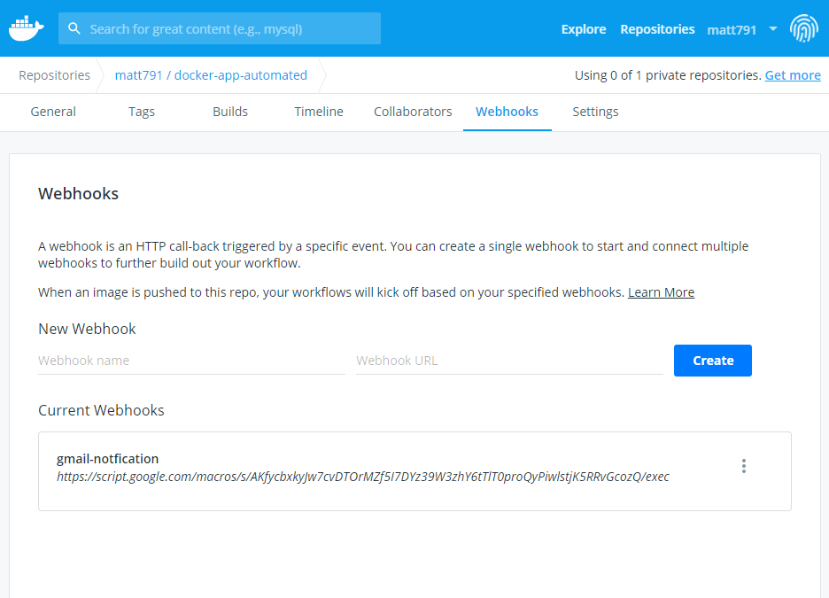

# Automation of the containerisation and deployment of the app on AWS
- The aim of this project, is to automate the entire process of containerising our app and deploying it onto the cloud if the code passes the necessary tests when pushed to the `dev` branch.
  - This was achieved by using: 
    - **Docker**
    - **Jenkins**
    - **AWS**

- [Task](TASK.md)
- [Setting up AWS Instances](AWS_EC2.md)
- [Setting up CI/CD Pipeline](CICD.md)
- [Connecting a Gmail Webhook to DockerHub repo](#gmail-webhook---dockerhub-repo)

## Containerising 
- To create Docker Images, Jenkins utilised the `Dockerfile` and then pushed the newly created image a `DockerHub Repo` by running a `Jenkinsfile`.

- Dockerfile image code:

```docker
# Select the latest node image to work from
FROM node:alpine

# Who edited this docker file
LABEL MAINTAINER=msokol@spartaglobal.com

# Choose the working directory
WORKDIR /usr/src/app

# 1. (. = copy whole current directory) 2. (. = to current working directory)
COPY . .

# Install npm
RUN npm install 

#####################
# Second stage -> Multi Stage Docker build
# FROM node:alpine

# Magical line -> Copies only essential things to the layer
# Compresses the size, creates a lighter weight image
# COPY --from=App /usr/src/app /usr/src/app

# WORKDIR /usr/src/app

# RUN npm install 

# Default port 3000
EXPOSE 3000

# Run seeds to see the posts appear, Start the app
CMD ["node",  "app.js"]
```

- Jenkinsfile [code](Jenkinsfile) -> Builds and pushes in Jenkins

## Deploying onto the browser/cloud
- Once the image has been pushed to DockerHub, Jenkins will pull the image and deploy it inside the `Live` EC2 instance by using the `docker-compose` file which also connects the app to a mongo database.
- Now the app can be seen working on the <Public_IP:3000> of the EC2 instance.

```yaml
version: "3.5"
services:
  mongo:
    container_name: mongo_db

    # Pulling the mongodb image from the web
    image: mongo

    # Restart the container whenever file is ran
    restart: always

    # Port 27017 as thats the port to access db
    ports:
      - "27017:27017"
    volumes: 
      - ./mongod.conf:/etc/mongod.conf
 

  app:
    container_name: prod-nodejs-app

    # Build from the image stored on the repository
    image: matt791/docker-app-automated
    
    # Build after mongo is created
    depends_on: 
      - mongo
    
    # Specify DB_HOST for app to run posts/ 
    environment:
      - DB_HOST=mongodb://mongo:27017/posts 

    # Link the db to app    
    links:
      - mongo
    ports:
      - "3000:3000"
  ```

## Gmail Webhook -> DockerHub Repo
- Once there has been a successful push to a DockerHub repo, we can notify the product owner by sending an automated email to them by utilising `Google Scripts` and `Webhooks`
**- To do this, ensure you allow permissions for Google to use your gmail**
- Google Script:

```go
  function doGet(e){
  return HtmlService.createHtmlOutput("request received");
}

function doPost(e) {
    var emailAddress = 'ahskhan@spartaglobal.com'
    var message = 'Hi Shahrukh! This email is to notify you that the docker push to my repo of `matt791/docker-app-automated` has been successful! '
    var subject = 'A new Docker Image has been pushed to `matt791/docker-app-automated`!';
    MailApp.sendEmail(emailAddress, subject, message);
    return HtmlService.createHtmlOutput()("post request received");
  
}
```
- Ensure to `Deploy` the code and receieve the `exec` link which can be attached to your webhook.
  - Paste the `exec` URL for your scipt on your DockerHub repo as seen below:


