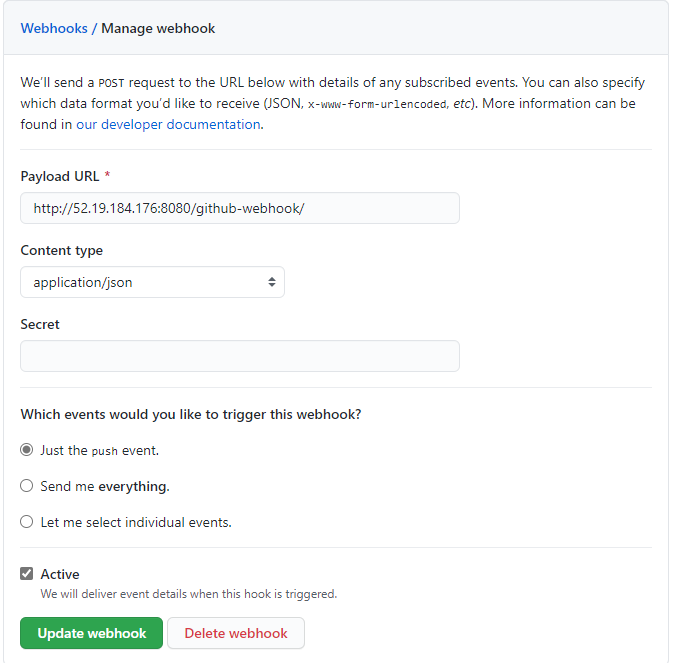

# Instructions of how to setup a CICD
- Once your Jenkins has been configured on your Jenkins Master EC2 instance, you can begin on the CI CD pipeline.

# CI 
- For the CI, our aim is for our Jenkins to detect a push to the `dev` branch in the repository, test that the code is running as desired, and push to `main` branch upon success. 
- Ensure you have connected your Jenkins to your GitHub repository with a Webhook:

- [x] Discard old build
  - [x] Days to keep builds : 1 
  - [x] Max# of build : 3 

set up docker on every instance

# S3 Bucket - Simple Storage Service
- Essentially a blank hard drive
- Used as disaster recovery plans
- Unlimited storage
- Can create a bucket with only `Read` permissions

Creating a bucket
- Bucket name -> eng74mattbucket
- Create

Permissions ->

gmail webhook -> ahskhan@spartaglobal.com

# About me page
# Test notifications
# Final Push task complete